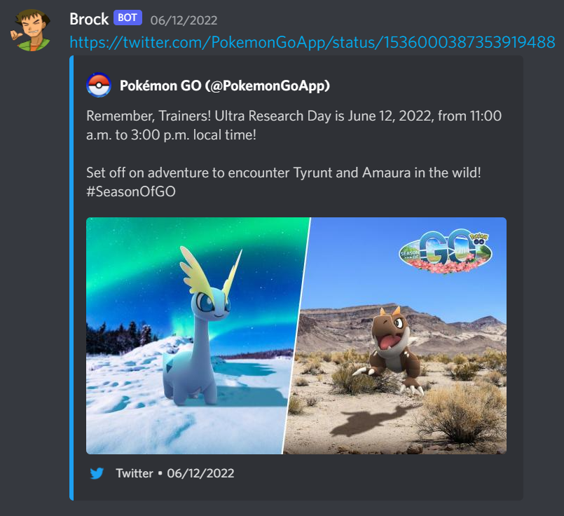

[](https://github.com/versx/Retweety/actions)
[](https://github.com/versx/Retweety/releases/)
[](https://discord.gg/zZ9h9Xa)  


# Retweety  
Repost tweeted messages from interested Twitter users via Discord webhooks.  

## Prerequisites  
- [.NET 5 SDK or higher](https://dotnet.microsoft.com/en-us/download/dotnet/5.0)  

## Getting Started  

### _Automated_  
1. Run automated install script (installs .NET 5 SDK and clones repository):  
```
curl https://raw.githubusercontent.com/versx/Retweety/master/scripts/install.sh > install.sh && chmod +x install.sh && ./install.sh && rm install.sh
```

### _Manually_  
Alternatively, if you already have .NET 5 SDK installed, run the following commands before proceeding below.  

1. `git clone https://github.com/versx/Retweety && cd Retweety`  
2. `dotnet build`  
3. `cp config.example.json bin/config.json`  

---
Once the project is cloned and .NET 5 SDK is installed continue on:  
1. Head to [Twitter's Developer Portal](https://developer.twitter.com/en/portal/dashboard)  
2. Create a new Twitter App, set name, description, and website, ignore callback url.  
3. Click `Keys and Access Tokens` tab to get your Twitter App credentials.  
4. Input your Twitter App's consumer key, consumer secret, access token, and access token secret in the `bin/config.json` config file.  
5. Set interested user ID(s) as property key(s) under the `accounts` config section.  
6. Set a new JSON key using the user ID of the Twitter account to take a list of webhook urls that will receive the tweeted message. See the below config example format if unsure.  
7. Input the bot properties under the `bot` config section to set the desired name and optional icon url.  
8. Build the executable file `dotnet build`.  
9. Start Retweety from the `bin` folder: `dotnet Retweety.dll`.  


## Configuration  
```json
{
    // Twitter API consumer key
    "consumerKey": "<TWITTER_ACCOUNT_CONSUMER_KEY>",
    // Twitter API consumer secret
    "consumerSecret": "<TWITTER_ACCOUNT_CONSUMER_SECRET>",
    // Twitter API access token
    "accessToken": "<TWITTER_ACCOUNT_ACCESS_TOKEN>",
    // Twitter API access token secret
    "accessTokenSecret": "<TWITTER_ACCOUNT_TOKEN_SECRET>",
    // Dictionary of interested users to repost tweeted messages
    "accounts": {
        // Twitter User ID to follow and repost tweets from
        "2839430431": [
            // List of webhooks the tweets will be sent to
            "https://discordapp.com/...."
        ]
    },
    // Bot display settings for embed post
    "bot": {
        // Bot name for Discord embed message
        "name": "Retweety",
        // Bot icon url for Discord embed message (optional)
        "iconUrl": ""
    },
    // Discord embed message template format
    "embedTemplate": "{{url}}"
}
```

## Available Template Keys  
| Key | Value | Description |  
| ---- | ----- | ----- |  
| `url` | https://twitter.com/34... | Tweet url |  
| `text` | This is a test tweet | Tweet text |  
| `full_text` | This is a test tweet from user test | Full Tweet text |  
| `id` | 34343434343 | Tweet ID |  


## Twitter Handle Converter  
https://tweeterid.com/  


## Preview  
